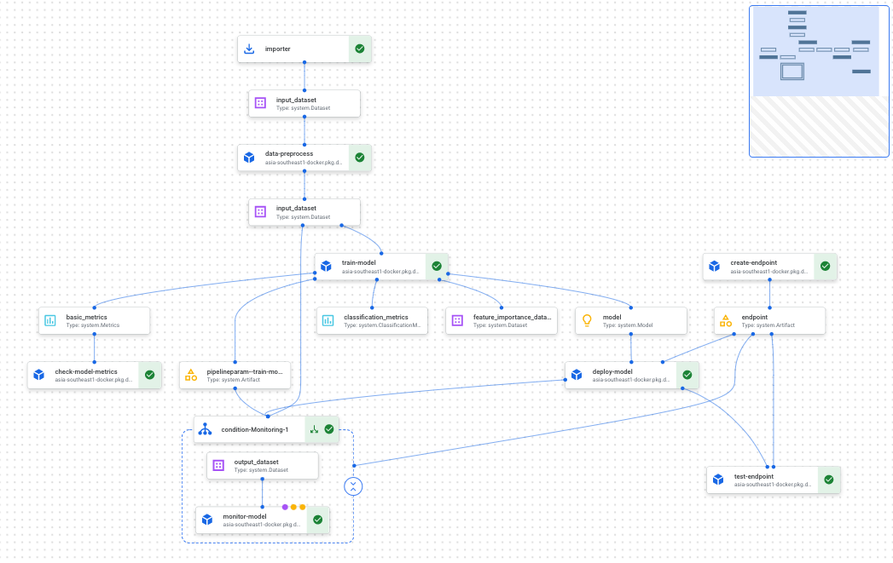

<!--
Copyright 2021 Google LLC. All Rights Reserved.

Licensed under the Apache License, Version 2.0 (the "License");
you may not use this file except in compliance with the License.
You may obtain a copy of the License at:

     http://www.apache.org/licenses/LICENSE-2.0

Unless required by applicable law or agreed to in writing, software
distributed under the License is distributed on an "AS IS" BASIS,
WITHOUT WARRANTIES OR CONDITIONS OF ANY KIND, either express or implied.
See the License for the specific language governing permissions and
limitations under the License.
==============================================================================
-->

# Vertex AI Pipeline
This repository demonstrates end-to-end [MLOps process](https://services.google.com/fh/files/misc/practitioners_guide_to_mlops_whitepaper.pdf) 
using [Vertex AI](https://cloud.google.com/vertex-ai) platform 
and [Smart Analytics](https://cloud.google.com/solutions/smart-analytics) technology capabilities.

In particular two general [Vertex AI Pipeline](https://cloud.google.com/vertex-ai/docs/pipelines) 
templates has been provided:
- Training pipeline including:
  - Data processing
  - Custom model training
  - Model evaluation
  - Endpoint creation
  - Model deployment
  - Deployment testing
  - Model monitoring
- Batch-prediction pipeline including
  - Data processing
  - Batch prediction using deployed model

Note that besides Data processing being done using BigQuery, all other steps are build on top of
[Vertex AI](https://cloud.google.com/vertex-ai) platform capabilities.

<p align="center">
    
</p>

### Dataset
The dataset used throughout the demonstration is
[Banknote Authentication Data Set](https://archive.ics.uci.edu/ml/datasets/banknote+authentication).
Data were extracted from images that were taken from genuine and forged banknote-like specimens. 
For digitization, an industrial camera usually used for print inspection was used. 
The final images have 400x 400 pixels. Due to the object lens and distance to the 
investigated object gray-scale pictures with a resolution of about 660 dpi were gained. 
Wavelet Transform tool were used to extract features from images.
Attribute Information:
1. variance of Wavelet Transformed image (continuous)
2. skewness of Wavelet Transformed image (continuous)
3. curtosis of Wavelet Transformed image (continuous)
4. entropy of image (continuous)
5. class (integer)

### Machine Learning Problem
Given the Banknote Authentication Data Set, a binary classification problem is adopted where 
attribute `class` is chosen as label and the remaining attributes are used as features.

[LightGBM](https://github.com/microsoft/LightGBM), a gradient boosting framework that uses tree based 
learning algorithms, is used to train the model for purpose of demonstrating 
[custom training](https://cloud.google.com/vertex-ai/docs/training/custom-training) and
[custom serving](https://cloud.google.com/vertex-ai/docs/predictions/use-custom-container) 
capabilities of Vertex AI platform, which provide more native support for e.g. Tensorflow,
Pytorch, Scikit-Learn and Pytorch.


## Repository Structure

The repository contains the following:

```
.
├── components    : custom vertex pipeline components
├── images        : custom container images for training and serving
├── pipelines     : vertex ai pipeline definitions and runners
├── configs       : configurations for defining vertex ai pipeline
├── scripts       : scripts for runing local testing 
└── notebooks     : notebooks used development and testing of vertex ai pipeline
```
In addition
- `build_components_cb.sh`: build all components under `components` folder using Cloud Build
- `build_images_cb.sh`: build custom images under `images` folder using Cloud Build
- `build_pipeline_cb.sh`: build training and batch-prediction pipeline under `pipelines` folder using Cloud Build

## Building and Running the Training / Prediction Pipelines

The end-to-end process of creating and running the training pipeline contains the following steps:

1. Create the components required to build and run the pipeline
2. Prepare the configuration files of the various steps of the pipeline
3. Build the pipeline
4. Run the pipeline

### Building Components

The components and supporting images can be built using the provided Cloud Build configuration files.

To build the supporting images, run the following in the source repo root directory:

```bash
sh build_images_cb.sh
```

To build the pipeline components, and the pipeline job specifications, run the following in the source repo root
directory:

```bash
sh build_components_cb.sh
```

To build the pipeline job specifications, run the following in the source repo root
directory:

```bash
sh build_pipeline_cb.sh
```

### Configuration and Execution

#### Manual Trigger

For manual triggering, the following two scripts should be updated:

* `scripts/run_training_pipeline.sh`
* `scripts/run_batch_prediction_pipeline.sh`